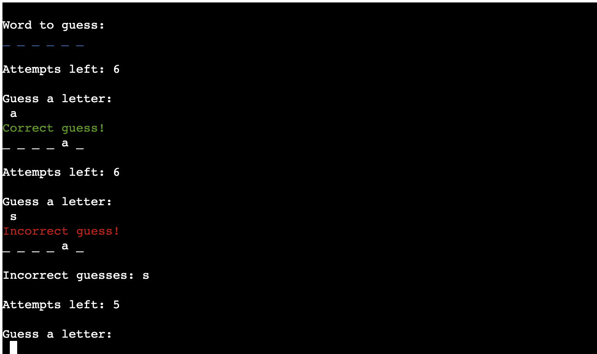
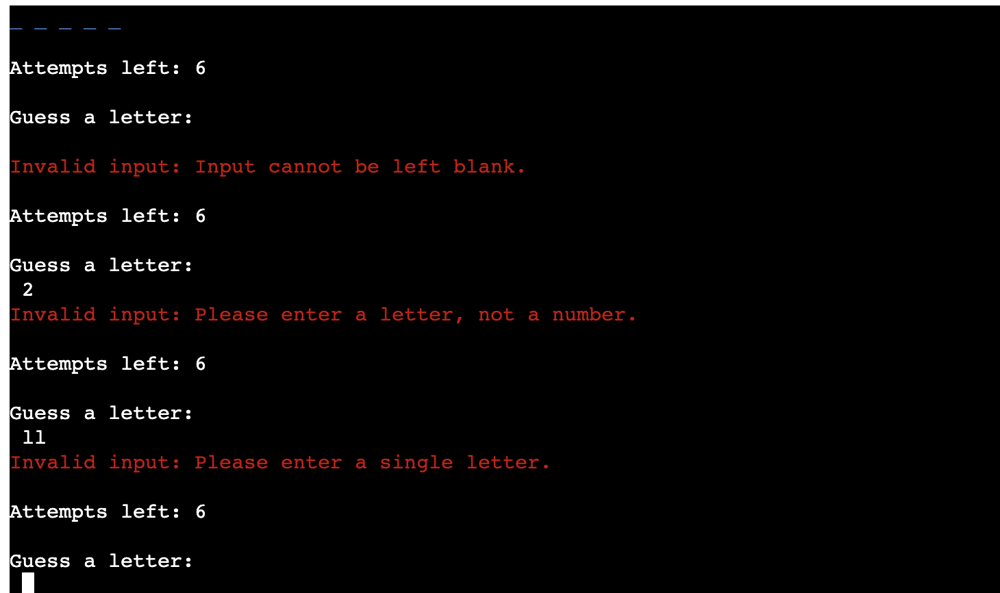
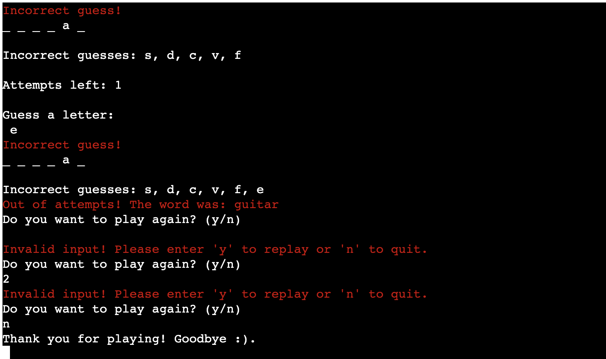

# Let's see if you can guess it!

   "Let's see if you can guess it!" is a word guessing game where the player needs to guess one letter at a time to find out a hidden word. Right guesses show letters, helping you uncover the word, however, incorrect guesses decrease the total attempts given from start, increasing the challenge until player succeeds or fails.

Link to the deployed project - [Click here](https://guess-the-word-fd228f60a7db.herokuapp.com/)

## How to play 
The game starts with a welcome message as well as all the rules explained followed by asking for your name.
Once you've entered your name, the game will start and you will need to guess a randomly generated word, one letter at a time.

You have a total of 6 attempts to guess the word correctly.

Once you guess a letter, it will display in the word to be guessed and it will continue until you either guess it entirely or fail.
If you have not guessed the correct letter, it will decrement by 1 from the total attempts until you ran out of attempts.

At the end of the game you will also have the option to choose if you want to play again or not.

# Planning Overview

## Site goals
- Ensure the game provides appropriate responses to all user inputs, creating a seamless and engaging gameplay experience.
- Provide clear and concise instructions within the game interface, guiding players on how to play effectively and all the rules listed.
- Prevent errors that might stop the player from playing the game.

## User-stories

### First-time user 
- As a first time user I expect clear instructions and a welcoming interface are important to help me get started smoothly.
- As a first-time user I expect prompt feedback during gameplay so i can be able to track my progress while guessing.
- As a first-time user I expect to have the option to play again at the end.

## Game Flow chart 

To create and understand the game steps I have created the below Flow chart using [Lucid charts](https://www.lucidchart.com/)

### Flow chart colours:
- green : initiates something
- blue : displays to terminal
- khaki : decision
- pink : user input required

# Existing Features 

## Welcome Screen
 
 - The welcome screen displays a welcome message to the player.
 - Explains how the game works and prompts the user for their name.

 - 

 - If the input is invalid, it prompts the user again until a valid input is provided.

 - 

## Game Screen
 - Once the user enters a valid name, the game screen displays a randomly selectee word from a predefined list of words and returns it.

 - It displays the word with blank spaces for each letter that the player needs to guess.

 - 
 

### Checking answers
 - If the player guessed letter is correct, it updates the display accordingly and underscores for the letters that are yet to be guessed.

 - If the player guessed letter is incorrect, it is added to the incorrect guessed list and decrements the total attempts by 1.

 - The correct letter is coloured in 'green' and the incorrect one in 'red'.

 - It allows the player a limited number of attempts (6) to guess the word.
 - 

 - It also points out any letters that have been previously guessed & that cannot be entered again:

 - 

 - For each guess, it checks if the input is valid and upon checking and incorrect , it wil display 'Invalid Input' text.

 - 

## Game End Screen
 - If the player runs out of attempts, it will display end of game message with the correct word and option to play again :
 - 

 - If the player guesses the word, it will display a Congratulations message and ask if you want to play again:
 - 

 - In order to play again the user will have to select 'y' or to quit 'n'.
 - If 'n' selected will dispay 'Thank you for playing' message , if 'y' entered will play again with a different word.
 

## Technologies used 
1. **Git** - Used to track changes in source code during software development.
2. **GitHub** - Used for version control
3. **Heroku** - Used to deploy the live project
4. **GitPod** - Used as an Integrated Development Environment (IDE) for building this website.

### Language used:
- Python

# Libraries

For this project to function, I imported the following libraries:

## Python standard library

### random:
I have imported this standard library in order to select random words from a pre-defined list and incorporate them into the game.

### time:

I have imported this standard library in this project to manage time-related functions, more specifically to add a 1s time delay on screen to enable player to read everything displayed before clearing the terminal.

### os:

I have imported this standard library to clear the terminal screen, preventing users from being overwhelmed with previous game sessions.

## 3rd party libraries

### Colorama:

Colorama is a Python library that adds colored text output in the terminal and has been used throughout the game to enhance user experience. 

 # Testing 

 ### Manual testing
 I have manually tested the game the following ways:

| About | Test  | Expected behaviour | Pass/Fail
--- | --- | --- | --- |
| Input Name | enter only letters in name and hit Enter | Will prompt the player to word to guess. | Pass
| Input Name | leave it blank and hit Enter| Will display Invalid input: Name cannot be left blank. | Pass
| Input Name | enter a number and hit Enter | Will display Invalid input: Please only enter letters for your name. | Pass
| Input Letter| leave it blank and hit Enter | Will display Invalid input: Input cannot be left blank. | Pass
| Input Letter | enter more than one letter and hit Enter | Will display Invalid input: Please enter a single letter.  | Pass
| Input Letter | enter a number and hit Enter| Will display Invalid input: Please enter a letter, not a number. | Pass
| Input Letter | enter a correct letter and hit Enter| Will display Correct guess! | Pass
| Input Letter | enter an incorrect letter and hit Enter| Will display Incorrect guess!| Pass
| Input Letter | enter a letter that has been previously guessed and hit Enter| Will display You've already guessed this letter. | Pass
| Guesses | guess correct letter| Will reveal letter in the word that is being guessed| Pass
| Guesses | guess incorrect letter| Will add letter to incorrect guesses list & decrement total attempts by 1| Pass
| Attempts | guess word before attempts finished| Will display Congratulations! You've guessed the word!| Pass
| Attempts | attempts finished| Will display Out of attempts! The word was:...| Pass
| Input Play Again | press Y to play again| Will display another random word and game will continue| Pass
| Input Play Again | guess N to finish game| Will display Thank you for playing! Goodbye message and finish game| Pass
| Input Play Again | press anything else besides Y or N| Will display Invalid input! Please enter 'y' to replay or 'n' to quit.| Pass

## Browser testing
I have played the game in different browsers such as Safari, Google Chrome and Microsoft Edge and no issues displayed.

## Validator Testing

### PEP8 Python Linter
- No errors were found, see below the screenshorts for run.py code:

## Unfixed bugs
No bugs were found.

# Deployment:

The project was deployed using Heroku. I have followed these below steps for deployment:

1. Login to [Heroku](https://id.heroku.com/login) or create a account.
2. On the main page, click the button labeled as New and from the drop-down menu select create New App.
3. Please enter a unique app name.
4. Select your region and click on Create App button
5. Within your page, navigate to settings tab
6. Scroll down to view the Config Vars section and click Reveal Config Vars.
7. Enter port into the Key box and 8000 into the Value box and click the Add button.
8. Next, scroll down to Buildpacks sections. Click Add buildpack and select python.
9. Within the same section, click Add buildpack and select nodejs. Note it has to be in order, first will be pytho and then nodejs.
10. Scroll up and navigate to Deploy tab.
11. Select Github as the deployment method
12. Search for the repository name and click the connect button
13. Scroll to the bottom of the deploy page and select the preferred deployment type
14. Click either Enable Automatic Deploys for automatic deployment when you push updates to Github or Manual deploy to deploy the current state of the branch you choose.

Live link can be found - [here](https://guess-the-word-fd228f60a7db.herokuapp.com/)

# Credits:
## Content & Resources used:
1. The text for the game was created by me.
2. [lucidchart.com](https://www.lucidchart.com/pages/) - Used to create the game flow chart.
3. Inspiration for code-structure from Code Institute's Love Sandwitches project.
4. README structure - Inspired by CI PP3 read-me template.
5. [W3schools](https://www.w3schools.com/) - To refresh my memory using functions.

## Mentions:
- I would like to mention my mentor Dick Vlaanderen who has helped me maintain good practice while coding and pointing out minor improvements that in the process of creating this word guessing game.